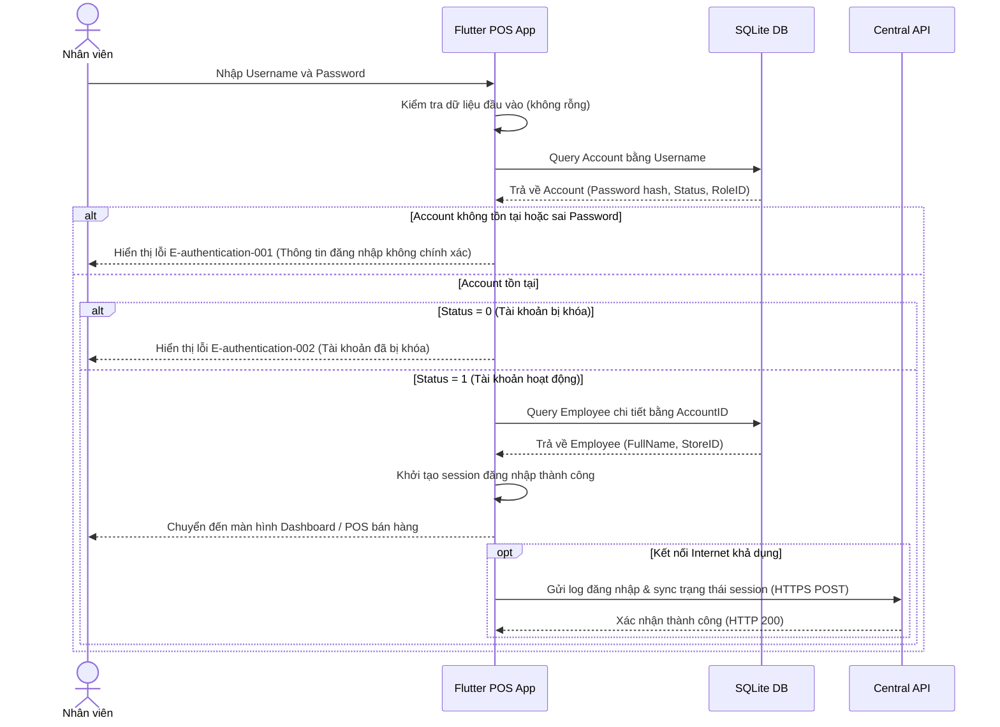

# Authentication — Flows

## Flow: Login/Authentication

**Trigger**: Người dùng mở ứng dụng và nhập thông tin đăng nhập (username, password).
**Related UC**: [[../usecases/uc-login.md]]
**Related FR**: FR-authentication-001
**Related E**: E-authentication-001, E-authentication-002

