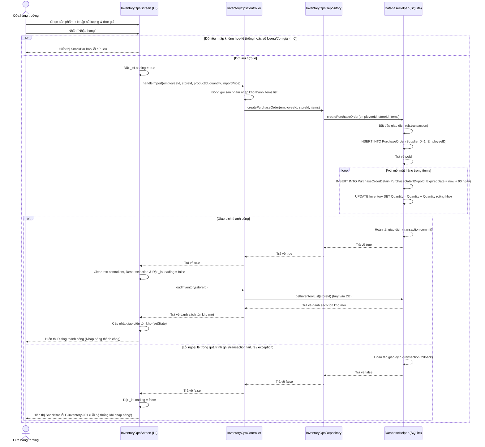

# Inventory — Flows

## Flow: Nhập kho (Happy + Error) — Sequence

**Trigger**: Cửa hàng trưởng điền thông tin nhập kho và bấm nút "Nhập hàng".
**Related UC**: [[../usecases/uc-import.md]]
**Related FR**: FR-inventory-001
**Related E**: E-inventory-001, E-inventory-002

