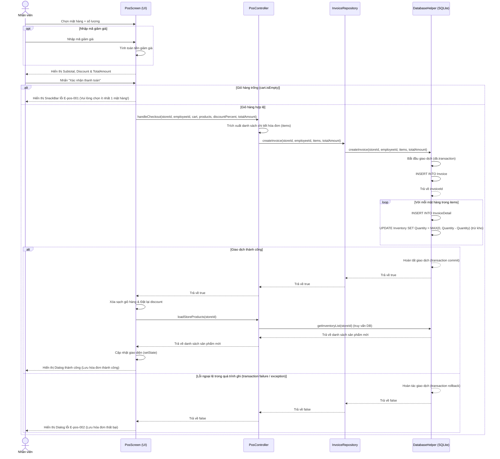

# POS — Flows

## Flow: Thanh toán POS cục bộ (Happy + Error) — Sequence

**Trigger**: Nhân viên nhấn nút "Xác nhận thanh toán" trên màn hình POS sau khi chọn món.
**Related UC**: [[../usecases/uc-checkout.md]]
**Related FR**: FR-pos-001
**Related E**: E-pos-001, E-pos-002

